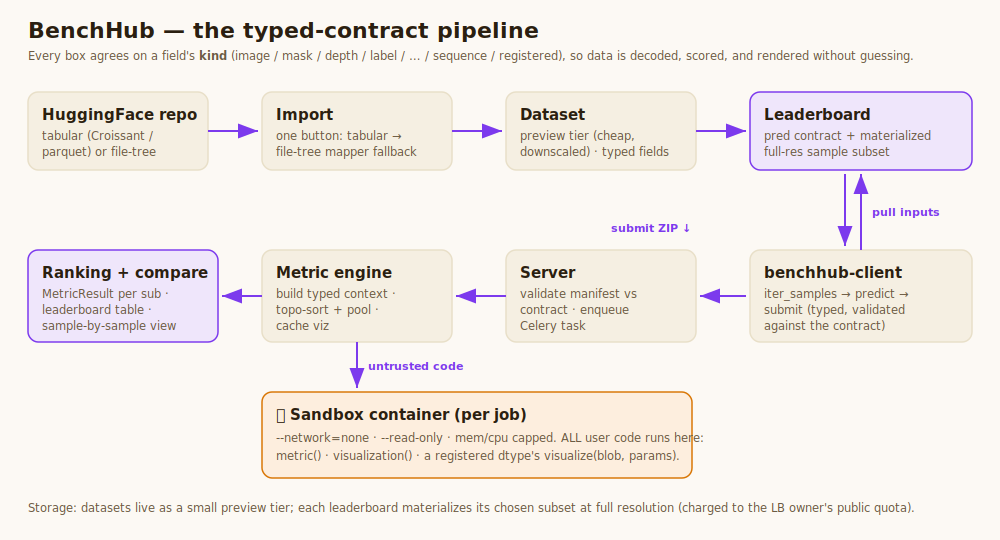

# BenchHub

**Benchmark model predictions against curated datasets — with a typed
contract end-to-end.** Pick (or import) a dataset, define metrics and
visualizations in Python, submit predictions with the client, and see how
your model ranks sample-by-sample. Live at **https://runbenchhub.com**.



---

## What makes it different

Everything hangs off one idea — a **typed contract**. Every field (a dataset
column, a leaderboard input, a prediction) declares a **kind**
(`image`, `mask`, `depth`, `audio`, `label`, `label_list`, `bboxes`,
`scalar`, `text`, `json`, `sequence`, `coco_detections`, plus any
user-**registered** kind). The dataset, the `benchhub-client`, and the metric
engine all agree on kinds, so data is decoded, scored, and rendered without
guessing. Kinds are defined in `benchhub/types.py` and listed live at
[`/supported_types`](https://runbenchhub.com/supported_types).

## Features

- **Passwordless auth** — GitHub, Google, or a one-time email code.
- **Self-service HuggingFace import** — one button: the **tabular** importer
  (Croissant / parquet) falls back automatically to a **file-tree mapper**
  (paired files, packed `.npz`/`.h5`/archives, video clips) with a
  "describe the structure" role wizard, loaders for
  file/token/npz/json/csv/parquet/hdf5/zip/tar/gz/sequence, a decode preview,
  variant fan-out, draft autosave, and a split/subfolder picker for huge
  repos. Datasets shown before import via their HF card.
- **Two-tier storage** — datasets cache as a cheap preview tier; each
  leaderboard materializes a chosen sample subset at full resolution.
- **Metrics & visualizations in Python** — typed signatures, per-sample +
  aggregated, pooling (mean/median/percentile/min/max), dependency chaining.
- **Hardened sandbox** — *all* user-supplied code (metrics, visualizations,
  and a registered type's `visualize`) runs in a short-lived
  `--network=none --read-only`, memory/CPU-capped container — never
  in-process on the server.
- **User-registered data types** — declare a new `kind` (its storage + a
  sandboxed `visualize(blob, params)`) from the web (`/supported_types`) or
  the client; it joins the global kind namespace and renders in the views.
- **`benchhub-client` + dev kit** — `iter_samples` → `predict` → `submit`;
  programmatic dataset creation; `create_metric` / `create_visualization` /
  `create_datatype`; and `benchhub.author.test_metric` / `test_visualization`
  to iterate locally before uploading.
- **Per-row visibility** (`public` / `unlisted` / `private`) with
  **dependency guards** — once another user depends on your dataset/LB
  (binds it / submits to it), it can't be made private or deleted.
- **Split-bucket quotas** — 50 GB public + 10 GB private per user (live usage
  on Account settings + the Storage-usage page).
- Async processing with Celery (Redis broker); API tokens; public landing,
  catalog (`/leaderboards`, `/datasets`), and profiles (`/u/<id>`).

## Quickstart (submitting to a leaderboard)

```bash
pip install -U benchhub-client      # PyPI: benchhub-client
```

```python
import benchhub as bh

client = bh.Client(token="bh_...")            # token from /settings/api_tokens
sub = client.submission(LB_ID, name="my-model-v1")

for sample_name, inputs in client.iter_samples(LB_ID):
    image = inputs["image"].array             # decoded bh.Image -> (H,W,3) uint8
    pred  = my_model(image)
    sub.predict(sample_name, label_pred=bh.Label(int(pred)))

print(sub.submit(description="ResNet-50"))
```

### Authoring metrics / visualizations / data types

```python
import benchhub as bh

def my_iou(gt: bh.Mask, pred: bh.Mask):       # input_kinds auto-derive from annotations
    g, p = gt.array, pred.array
    inter = ((g == 1) & (p == 1)).sum(); union = ((g == 1) | (p == 1)).sum()
    return float(inter / union) if union else 1.0

bh.author.test_metric(my_iou, gt=gt_mask, pred=pred_mask)   # iterate locally
client.create_metric("my_iou", my_iou)                      # then upload (sandboxed server-side)
```

`client.create_visualization(...)` (returns a `PIL.Image`) and
`client.create_datatype(...)` (a new kind + a sandboxed `visualize`) work the
same way.

## Documentation

- **In-app docs** at [`/docs`](https://runbenchhub.com/docs): overview, core
  concepts, importing data, data types, leaderboards, writing metrics &
  visualizations, submitting predictions, API/client reference, tutorials.
- **Architecture:** [`docs/ARCHITECTURE.md`](docs/ARCHITECTURE.md) (editable
  drawio source under [`docs/diagrams/`](docs/diagrams/)).
- **Dev notes / history:** [`CLAUDE.md`](CLAUDE.md) (durable architecture +
  gotchas), the granular subsystem notes under [`skills/`](skills/), and the
  dated notes under [`docs/`](docs/).
- **Feature requests + bugs:** [GitHub issues](https://github.com/yakirma/BenchHub/issues).

## Run it locally

```bash
python -m venv venv && source venv/bin/activate
pip install -r requirements.txt

redis-server                                   # 1. broker (port 6379)
celery -A app.celery worker --loglevel=info    # 2. worker
python app.py                                  # 3. web app  -> http://localhost:6060
```

The database + uploads live outside the repo in a data directory — set its
location with `BENCHHUB_DATA_DIR=/some/path`. To run user code in the
container sandbox locally, install Docker, build the runner image
(`docker build -f runner/Dockerfile -t benchhub-runner .`), and set
`BENCHHUB_SANDBOX_METRICS=1`.

## Tests

```bash
pytest tests/         # ~1080 tests; use tests/ (not bare pytest)
```

## Deployment

Self-hosted on an Ubuntu box at `runbenchhub.com` (gunicorn + celery + redis
under systemd, nginx + certbot, Cloudflare DNS-only). The operational
runbook — push flow, `.env` keys, logs, rollback — is
[`docs/SELFHOST_RUNBOOK.md`](docs/SELFHOST_RUNBOOK.md).

## License

MIT — see [`LICENSE`](LICENSE).
